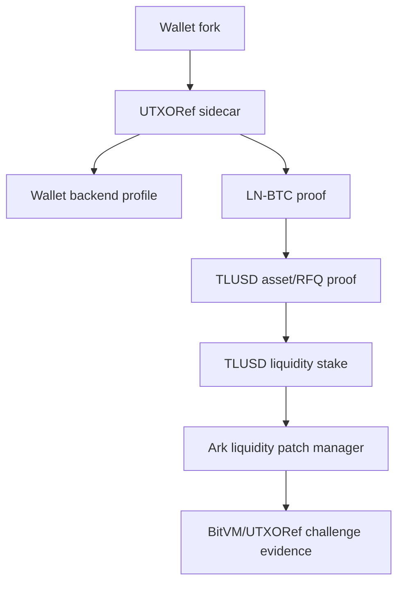

# UTXORef Wallet Demo Package

This package is a reviewer path for the wallet-facing Lightning adoption demo.

The demo shows:

```text
LN-BTC -> UTXORef funding -> TLUSD -> TLUSD stake -> Ark liquidity patch -> BitVM challenge evidence
```

The wallet UI is designed to run first against a local Litecoin testnet/mock
backend, then switch to Bitcoin testnet LND without changing the wallet screen.

## Quick Start

From the repo root:

```powershell
powershell -ExecutionPolicy Bypass -File integrations/wallet-demo/launch_wallet_demo.ps1
```

The script regenerates the TLUSD liquidity patch artifact, runs focused tests,
starts the sidecar, and prints the key URLs.

Expected sidecar URLs:

```text
GET  http://127.0.0.1:8787/v1/wallet-demo/status
GET  http://127.0.0.1:8787/v1/wallet-demo/config
GET  http://127.0.0.1:8787/v1/wallet-demo/stress-dashboard
GET  http://127.0.0.1:8787/v1/lnbtc-tlusd-liquidity-patch/wallet-view
POST http://127.0.0.1:8787/v1/lnbtc-tlusd-liquidity-patch/verify
POST http://127.0.0.1:8787/v1/lnbtc-tlusd-liquidity-patch/challenge
```

Dashboard:

```text
http://127.0.0.1:8787/dashboard
http://127.0.0.1:8787/v1/wallet-demo/stress-dashboard?bots=5000
```

## Current Demo Output

The deterministic artifact currently demonstrates:

- LN-BTC input: `49,000 sats`
- TLUSD externalized: `49 TLUSD`
- TLUSD staked: `40 TLUSD`
- routing notional: `40,000 sats`
- Ark patch assigned: `40,000 sats`
- delivered liquidity: `36,000 sats`
- slashable route failures: `1`
- verification: `ok`

The sidecar status endpoint reports `walletViewReady: true` when the artifact is
present and verified.

## Wallet Integration Files

ZEUS-style React Native mock screens:

- `integrations/zeus/TlusdLiquidityPatchScreen.tsx`
- `integrations/zeus/WalletDemoSettingsScreen.tsx`
- `integrations/zeus/tlusdLiquidityPatchClient.ts`

Older lease-only mock:

- `integrations/zeus/LiquidityLeaseScreen.tsx`
- `integrations/zeus/liquidityLeaseClient.ts`

Backend profile and tests:

- `integrations/wallet-demo/walletBackendProfiles.js`
- `integrations/wallet-demo/walletBackendProfiles.test.js`
- `integrations/wallet-demo/stressDashboard.js`
- `integrations/wallet-demo/stressDashboard.test.js`

Stress dashboard:

- `integrations/wallet-demo/dashboard.html`
- `integrations/wallet-demo/dashboard.css`
- `integrations/wallet-demo/dashboard.js`
- `integrations/wallet-demo/run_stress_simulation.js`

Run the stress simulation report directly:

```powershell
node integrations/wallet-demo/run_stress_simulation.js --scenarios 96,512,2048,5000
```

This writes:

- `bitvm3/utxo_referee/artifacts/wallet_stress_simulation_latest.json`
- `bitvm3/utxo_referee/artifacts/wallet_stress_simulation_latest.md`

LDK server-style API sketch:

- `integrations/ldk-server/liquidity_lease.proto`

## Demo Modes

### Local Development

Use the default local Litecoin profile:

```powershell
$env:WALLET_DEMO_PROFILE="litecoin-testnet-local"
node integrations/lightning-liquidity-lease-sidecar/server.js
```

This profile keeps the wallet UI connected to the local sidecar and labels the
chain source as `litecoin-testnet`.

### Bitcoin Testnet LND Go-Live

Use the Bitcoin testnet LND profile when a real LND backend is configured:

```powershell
$env:WALLET_DEMO_PROFILE="bitcoin-testnet-lnd"
$env:BITVM_CHAIN="bitcoin-testnet"
$env:LND_REST_URL="https://127.0.0.1:8080"
$env:LND_GRPC_HOST="127.0.0.1:10009"
$env:LND_MACAROON_PATH="C:\path\to\admin.macaroon"
$env:LND_TLS_CERT_PATH="C:\path\to\tls.cert"
node integrations/lightning-liquidity-lease-sidecar/server.js
```

The wallet screen continues to call the same TLUSD liquidity patch endpoints.
Only the backend profile changes.

## Reviewer Script

Run:

```powershell
powershell -ExecutionPolicy Bypass -File integrations/wallet-demo/launch_wallet_demo.ps1
```

Useful options:

```powershell
powershell -ExecutionPolicy Bypass -File integrations/wallet-demo/launch_wallet_demo.ps1 -NoStartSidecar
powershell -ExecutionPolicy Bypass -File integrations/wallet-demo/launch_wallet_demo.ps1 -Profile bitcoin-testnet-lnd
```

## Honest Boundary

Live or locally exercised now:

- deterministic LN-BTC -> TLUSD -> stake -> Ark patch -> BitVM challenge artifact
- sidecar wallet API
- stress dashboard for deterministic tLTC/TLUSD fleet quantities
- wallet backend profile switching
- ZEUS-style screens for patch and settings
- Litecoin-oriented live chain harness and replay pipeline

Modeled or still integration work:

- real `tapd` TLUSD issuance and proof import
- real Ark ASP VTXO membership proofs and round signatures
- production BitVM challenge transaction construction
- Bitcoin testnet validation/broadcast unless a Bitcoin backend is configured

## Architecture


