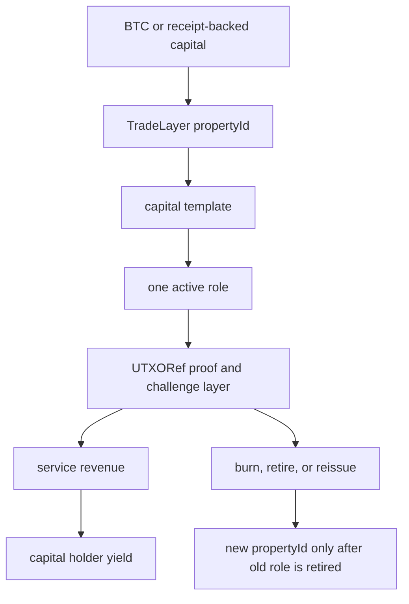
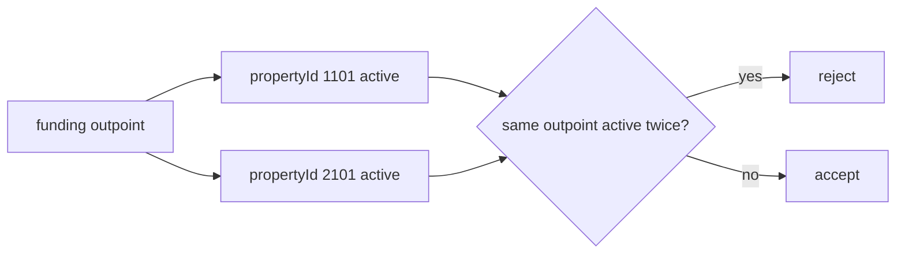
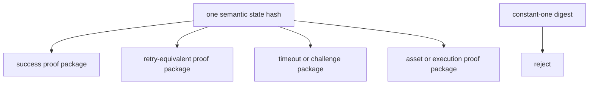
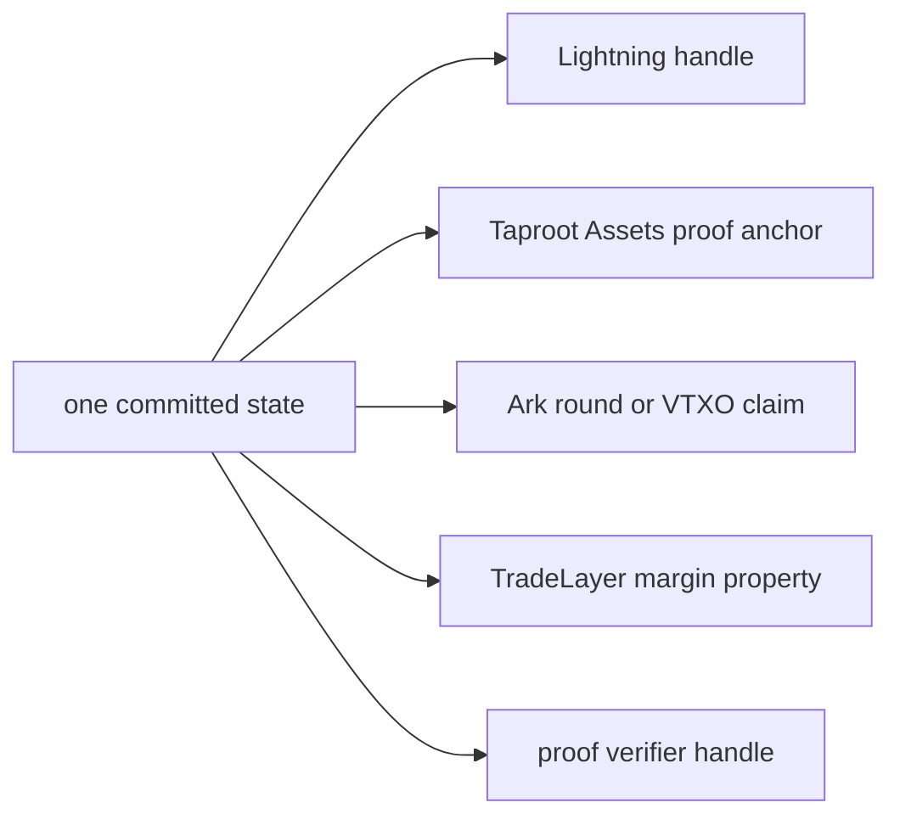
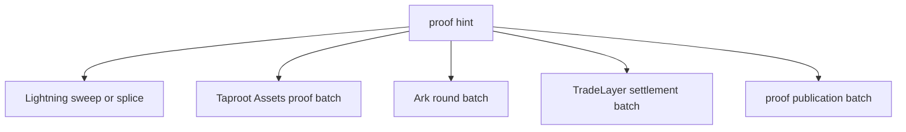
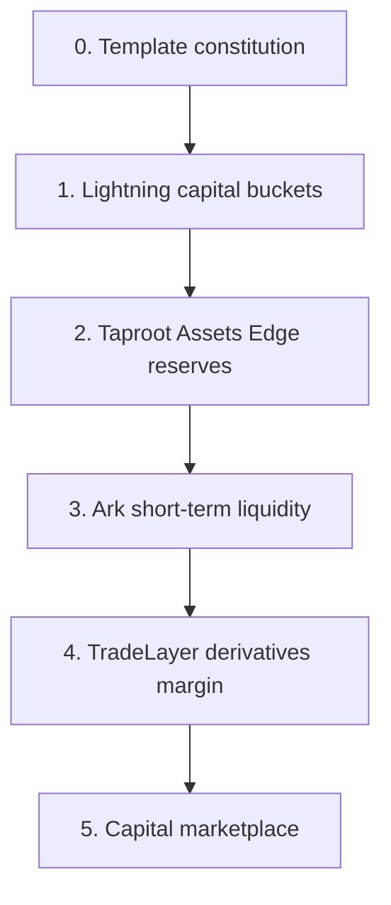

# Halal-Oriented Capital Staking Roadmap

This roadmap turns UTXORef, TradeLayer, Lightning, Taproot Assets, Ark, and the
Jurassic Bitcoin review into one product direction: capital-stakable Bitcoin
liquidity with no rehypothecation.

This document is a product and protocol-control scaffold, not a religious
certification. The principle is simple:

```text
one sat, one role, one active commitment
```

If a strategy uses different mechanics, it receives a different TradeLayer
`propertyId`. A `propertyId` is therefore not just metadata. It is the product's
economic and enforcement boundary.

## Capital Stack



Yield comes from services performed by reserved capital:

- Lightning channel leases and routing reserves
- Taproot Assets Edge-node RFQ liquidity
- Ark round liquidity grafts
- TradeLayer DLC and derivatives margin reserves
- watchtower and challenger bonds
- proof-publication and verifier bonds

It does not come from lending the same capital twice.

## Property Template Constitution

Each template binds:

- one `propertyId`
- one capital mechanic
- one active role
- one enforcement template
- one UTXORef verifier surface
- one set of Jurassic mechanism refs

| propertyId | Symbol | Role | Revenue source |
| --- | --- | --- | --- |
| `1101` | `HLN-LEASE` | Lightning channel lease | fixed-duration inbound lease and route-quality fees |
| `1102` | `HLN-ROUTE` | Lightning routing reserve | routing fees and availability premiums |
| `2101` | `HTAP-RFQ` | Taproot Assets Edge RFQ reserve | Edge spread and proof-anchor service fees |
| `3101` | `HARK-LIQ` | Ark round liquidity graft | short-duration liquidity and VTXO exit insurance premium |
| `4101` | `HTL-DLCM` | TradeLayer DLC margin reserve | bounded PnL settlement, margin reservation, liquidation fees |
| `5101` | `HWT-BOND` | Watchtower bond | challenge bounty, monitoring fee, fraud-proof service fee |
| `6101` | `HPROOF` | Proof-publication bond | proof publication, verifier receipt, challenge-routing fee |

## Non-Rehypothecation Rule



The verifier rejects the same active funding outpoint across different
property IDs. Moving capital from one role to another requires a burn, retire,
or reissue transition.

## Jurassic Applications We Can Use

The Jurassic Bitcoin review produced three useful application families. They
are not old bugs being revived. They are protocol mechanics abstracted into
modern proof and product surfaces.

### 1. Transcript Multiplicity

Use this for:

- Lightning PTLC/adaptor success vs timeout proof packages
- alternative DLC outcome proof wrappers
- Taproot Assets proof package variants
- Ark cooperative round vs exit package separation
- proof-carrying execution traces

How:



UTXORef stores a `transcriptSwitchboardId` so a verifier can distinguish
retry-equivalent proofs, branch-splitting proofs, and rejected digest-collapse
hazards.

### 2. Identifier Bifurcation

Use this for:

- Lightning route or rendezvous handles
- watchtower alert sessions
- Taproot Assets proof anchors and universe labels
- Ark round, VTXO, and claim handles
- TradeLayer derivatives margin template ids
- verifier handles for proof-publication systems

How:



The public handle can rotate without changing the committed capital state.
This is useful for privacy, retry lanes, market segmentation, and clean
operator accounting.

### 3. Carrier Camouflage

Use this for:

- Lightning sweeps, splices, closes, and maintenance transactions
- Taproot Assets proof batches or distribution activity
- Ark round batches and offboard settlements
- TradeLayer settlement batches
- proof publication folded into ordinary settlement flow

How:



The proof hint is bound to a `carrierCommitmentId`. Watchers can index it, but
the publication surface is an ordinary service action rather than a one-off
marker.

## Product Roadmap



### Phase 0: Template Constitution

Build the registry and enforce:

- no active funding outpoint reuse
- one `propertyId` per mechanic
- burn or retire before role transition
- no hidden leverage
- no guaranteed APY language

Implemented scaffold:

- `halal_capital_template_registry.js`
- `halal_capital_template_registry.test.js`

### Phase 1: Lightning Capital Buckets

Start with the most direct service revenue:

- `HLN-LEASE`: fixed-duration inbound channel leases
- `HLN-ROUTE`: routing reserve with fee-share accounting
- `HWT-BOND`: watchtower bond for challenge and monitoring services

Jurassic mechanics used:

- transcript switchboard for success/timeout proof packages
- identifier bifurcation for route and alert handles
- carrier camouflage for sweep, splice, and wallet-maintenance publication

### Phase 2: Taproot Assets Edge Reserves

Add Edge-node RFQ liquidity:

- `HTAP-RFQ`: capital reserved for asset/BTC conversion
- proof-anchor handles rotate while the RFQ claim remains fixed
- challenge evidence covers amount, spread, expiry, and proof mismatch

Jurassic mechanics used:

- proof package variants
- proof-anchor namespace rotation
- asset distribution or proof-batch carrier cover

### Phase 3: Ark Short-Term Liquidity

Use Ark-style rounds as short-duration capital grafts:

- `HARK-LIQ`: round liquidity and VTXO exit/forfeit reserve
- useful for bursty Lightning route demand
- useful for temporary derivatives margin support

Jurassic mechanics used:

- cooperative round vs exit transcript separation
- VTXO and round handle bifurcation
- round-batch carrier cover

### Phase 4: TradeLayer Derivatives Margin

Make derivatives capital explicit and property-specific:

- `HTL-DLCM`: DLC margin reserve
- bounded PnL settlement
- liquidation templates
- oracle and state-root challenge logic

Jurassic mechanics used:

- transcript multiplicity for outcome proof packages
- identifier bifurcation for margin template ids and oracle sessions
- carrier camouflage for settlement batch publication

### Phase 5: Capital Marketplace

Expose a capital marketplace where holders choose property templates, not vague
yield pools:

- capital holder selects `propertyId`
- operator bids for capital
- UTXORef checks exclusive funding
- TradeLayer tracks balances, state transitions, and redemption
- watchers monitor proof handles and carrier commitments
- yield is distributed from measured service revenue

## Current Deterministic Artifact

The first runnable marketplace surface is generated by
`halal_capital_marketplace_demo.js`, and the first TradeLayer procedural-token
wiring is generated by `halal_capital_tradelayer_tokens.js`. The first
property-specific protocol bundle portfolio is generated by
`halal_capital_protocol_bundles.js`:

- `artifacts/halal_capital_marketplace_latest.json`
- `artifacts/halal_capital_marketplace_latest.md`
- `artifacts/halal_capital_tradelayer_tokens_latest.json`
- `artifacts/halal_capital_tradelayer_tokens_latest.md`
- `artifacts/halal_capital_protocol_bundles_latest.json`
- `artifacts/halal_capital_protocol_bundles_latest.md`

The Omani Sukuk-stablecoin launch track is generated by
`omani_fiqh_stablecoin_compliance.js` and
`sukuk_stablecoin_halal_defi.js`:

- `artifacts/omani_fiqh_stablecoin_compliance_latest.json`
- `artifacts/omani_fiqh_stablecoin_compliance_latest.md`
- `artifacts/sukuk_stablecoin_halal_defi_latest.json`
- `artifacts/sukuk_stablecoin_halal_defi_latest.md`

This track keeps the par stablecoin as a no-yield redemption instrument while
separate pledged mandates can earn service fees from Lightning routing corridors
or bounded TradeLayer spot arbitrage. The launch checklist gates Omani/Ibadi-aware
Sharia review, Islamic bank custody, reserve/redemption controls, CBO/FSA perimeter
memos, AML monitoring, and a closed halal DeFi pilot before any wider issuance.

The marketplace artifact materializes one demo commitment for every property
template, verifies that no active funding outpoint is reused, emits
service-revenue events, and builds an observer index keyed by `propertyId`,
`publicHandleId`, and `carrierCommitmentId`.

The TradeLayer token artifact turns that snapshot into property-scoped
procedural token specs, principal mint events, service-revenue credit events,
and a burn-before-reissue instruction. Principal receipt supply is checked
against active committed capital; service revenue is checked against measured
service events and does not inflate principal supply.

The protocol bundle artifact currently covers three application properties:

- `HLN-LEASE` binds the capital receipt to a Lightning liquidity lease bundle.
- `HARK-LIQ` binds the capital receipt to an Ark VTXO liquidity graft with a
  verified supporting Lightning lease.
- `HTL-DLCM` binds the capital receipt to a TradeLayer oracle-DLC bundle plus a
  PnL settlement/challenge artifact.

Each bundle carries its own service-revenue credit and a burn-before-reissue
transition into the next property role, so the demo now shows how capital exits
one role before entering another.

The TradeLayer BitVM stack dashboard now binds the token-plan hash and exposes a
capital view with principal supply, service revenue accrual, property-template
count, and per-property rows:

- `artifacts/tradelayer_bitvm_stack_latest.json`
- `artifacts/tradelayer_bitvm_stack_latest.md`

## What To Build Next

1. Add protocol-specific bundles for the remaining `HLN-ROUTE`, `HTAP-RFQ`,
   `HWT-BOND`, and `HPROOF` properties.
2. Add operator/challenge status rows to the capital dashboard view.
3. Feed the property-specific token-plan and protocol-bundle events into the live Litecoin
   TradeLayer harness once the local deterministic event shape stabilizes.
4. Convert the Omani launch checklist into a deal-room pack: SSB appointment
   packet, Islamic bank reserve term sheet, CBO/FSA memo requests, and pilot go/no-go
   checklist.
