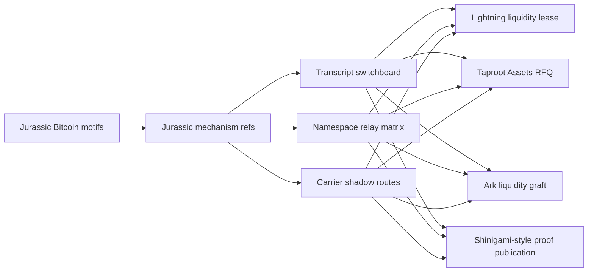
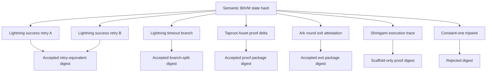
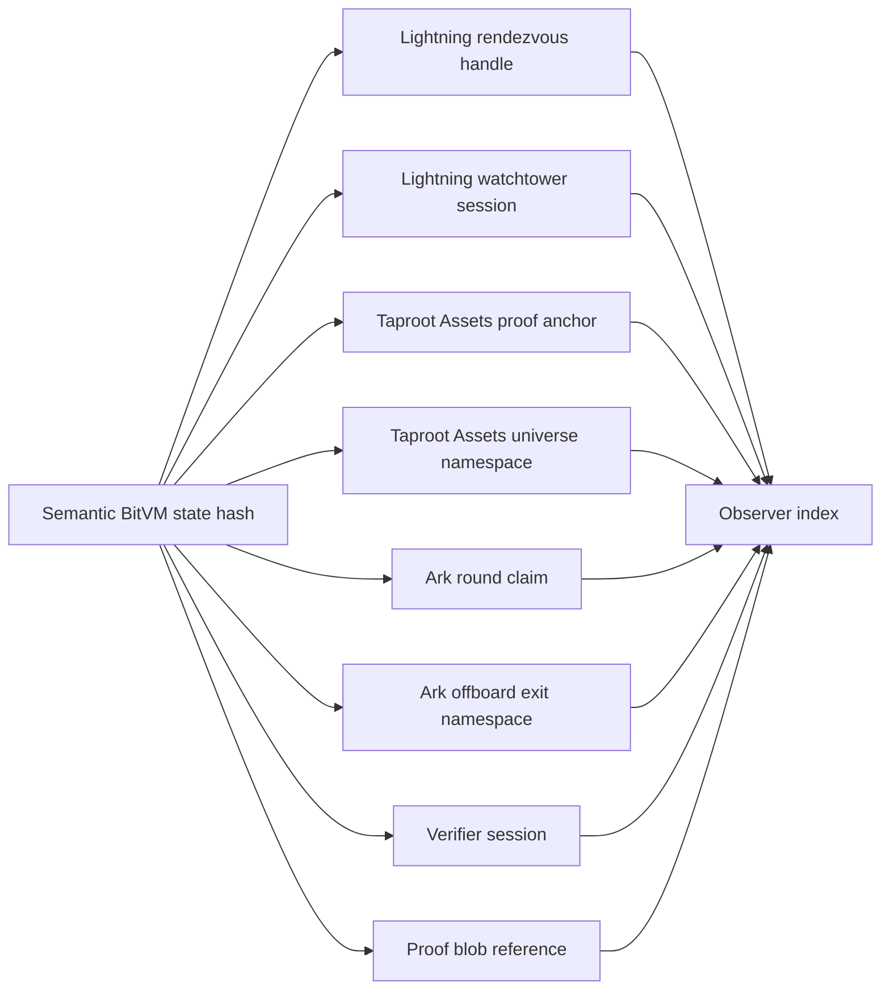
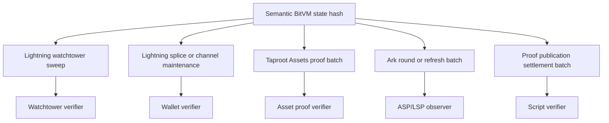
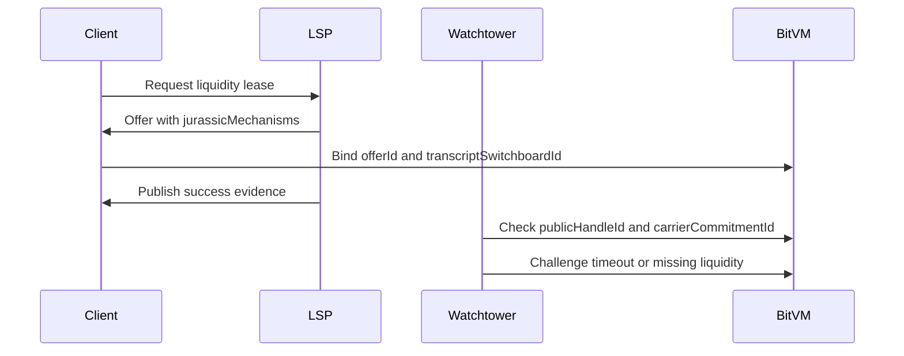
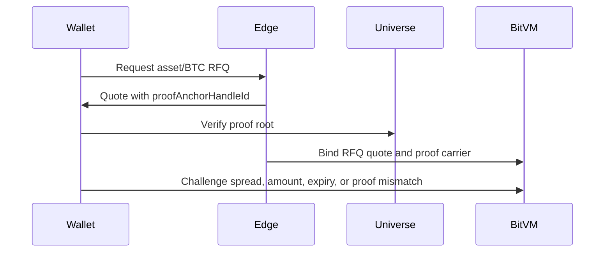
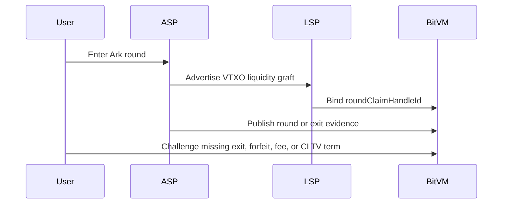
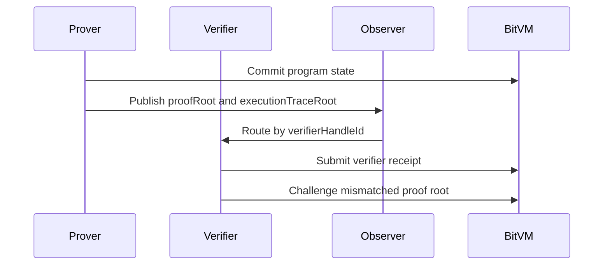

# Jurassic BitVM Mechanisms Report

This report explains how the Jurassic Bitcoin motifs were executed inside the
UTXORef BitVM prototype layer.

The implementation is intentionally additive. It does not replace the existing
Lightning, Taproot Assets, Ark, DLC, or TradeLayer prototypes. It adds a shared
mechanism reference layer that lets those prototypes express three reusable
BitVM patterns:

- transcript multiplicity
- identifier bifurcation
- carrier camouflage

The core implementation lives in `jurassic_bitvm_mechanisms.js`. The generated
catalog lives in `artifacts/jurassic_bitvm_mechanisms_latest.{json,md}`.

## Executive Summary

The new layer turns historical Bitcoin "fossil" motifs into deterministic
BitVM-visible handles:

- `transcriptSwitchboardId`: identifies the accepted proof-package transcript
  family for one semantic BitVM state.
- `publicHandleId`: identifies a rotated public namespace handle for that same
  state.
- `carrierCommitmentId`: identifies the ordinary-looking publication route or
  protocol topology used to carry proof hints.
- `rejectionTripwireDigest`: rejects the constant-one digest family before it
  can become a funding, claim, or challenge id.

Those handles are now bound into:

| Target | Prototype file | Mechanism executed |
| --- | --- | --- |
| Lightning | `lightning_liquidity_lease.js` | PTLC/lease proof switchboard, watchtower handle, sweep/splice carrier |
| Taproot Assets | `lightning_taproot_assets_stablecoin.js` | proof-anchor namespace, RFQ proof package, distribution carrier |
| Ark | `lightning_ark_liquidity_graft.js` | round/VTXO claim handle, exit transcript, round-batch carrier |
| Shinigami-style verifier | `shinigami_proof_publication.js` | proof publication scaffold, verifier handle, execution trace carrier |

## System Diagram

The key invariant is that all target-specific handles derive from one semantic
state hash. Each protocol gets different operational handles, but the BitVM
claim being proven remains stable.

## Mechanism 1: Transcript Switchboard

The transcript switchboard converts transcript multiplicity into a controlled
BitVM mechanic. A claim can accept multiple proof packages for one semantic
state, while explicitly rejecting hazardous digest-collapse cases.

### Why this matters

BitVM systems often need to distinguish between:

- equivalent retries of the same proof package
- distinct challenge branches
- proof formats from different overlay systems
- digest-collapse hazards that must never become ids

The switchboard makes that distinction explicit and testable.

### UTXORef use cases

| Use case | How it applies |
| --- | --- |
| Lightning PTLC or lease proof | retry-equivalent success proofs can alias, while timeout challenge proofs split |
| DLC or oracle proof package | one economic outcome can be wrapped in multiple proof packages |
| Ark round exit | cooperative round proof and exit proof can be distinct packages over one claim |
| Proof-carrying execution | verifier receipts can point to alternate execution transcript packages |

## Mechanism 2: Namespace Relay Matrix

The namespace relay matrix converts identifier bifurcation into protocol-specific
public handles. It allows a public handle to move while the semantic state hash
stays fixed.

### Why this matters

Overlay systems need public coordination handles:

- route or rendezvous labels
- proof anchors
- round ids
- verifier sessions
- watchtower alert handles

Those handles should be rotatable without changing the underlying claim.

### UTXORef use cases

| Use case | How it applies |
| --- | --- |
| Lightning route blinding | a route handle can rotate while the lease state is fixed |
| Watchtower alerts | watcher sessions can use different public alert ids for one proof state |
| Taproot Assets proof sync | proof-anchor and universe handles can rotate independently of asset state |
| Ark VTXO claims | round ids and claim handles can move around one VTXO commitment |
| Shinigami-style proof publication | verifier sessions and proof blob references can be separate public ids |

## Mechanism 3: Carrier Shadow Routes

Carrier shadow routes convert carrier camouflage into a BitVM publication
mechanic. Instead of publishing explicit marker transactions, proof hints are
bound to ordinary protocol topologies.

### Why this matters

The publication surface is part of the protocol design. A proof hint that is
easy to index may also be easy to fingerprint. Carrier routes let prototypes
experiment with proof publication that looks like ordinary protocol activity.

### UTXORef use cases

| Use case | Carrier surface |
| --- | --- |
| Lightning liquidity lease | watchtower sweep, splice, or channel maintenance carrier |
| Taproot Assets RFQ | proof-anchor batch or asset distribution carrier |
| Ark graft | round batch, refresh batch, or offboard settlement carrier |
| Shinigami-style proof | ordinary settlement batch with a verifier receipt sidecar |

## Target Walkthroughs

### Lightning

The Lightning prototype now commits to `jurassicMechanisms` inside lease terms.
Success and challenge evidence both bind the same `jurassicMechanismRefId`,
`transcriptSwitchboardId`, `publicHandleId`, and `carrierCommitmentId`.

Primary use cases:

- PTLC/adaptor success proof retries
- timeout challenge separation
- watchtower alert handle rotation
- sweep or splice carrier cover

### Taproot Assets

The Taproot Assets prototype now attaches Jurassic refs to the RFQ quote:
`proofAnchorHandleId`, `proofCarrierCommitmentId`, and `proofTranscriptDigest`.
Settlement and challenge evidence bind those same fields.

Primary use cases:

- proof-anchor search
- universe namespace rotation
- proof package variants
- issuance or distribution batch carrier cover

### Ark

The Ark liquidity graft prototype now attaches `roundClaimHandleId`,
`roundCarrierCommitmentId`, and `roundTranscriptDigest` to quote, settlement,
challenge, and bundle cores.

Primary use cases:

- VTXO claim namespace rotation
- round and offboard exit handles
- cooperative round vs exit transcript separation
- round-batch carrier cover

### Shinigami-Style Proof Publication

The Shinigami target is deliberately scaffold-only. The local module models
proof publication, verifier receipt, and challenge evidence without claiming a
production Shinigami verifier exists in this repo.

Primary use cases:

- proof package variants over one program state
- verifier handle rotation
- proof blob reference rotation
- ordinary settlement batch cover for proof publication

## Verification Surface

The following tests exercise the report's claims:

| Test | What it verifies |
| --- | --- |
| `jurassic_bitvm_mechanisms.test.js` | catalog invariants, target refs, digest tripwire |
| `lightning_liquidity_lease.test.js` | Lightning lease evidence binds Jurassic refs |
| `lightning_taproot_assets_stablecoin.test.js` | Taproot Assets RFQ binds proof anchor refs |
| `lightning_ark_liquidity_graft.test.js` | Ark quote and settlement bind round handles |
| `shinigami_proof_publication.test.js` | proof publication scaffold binds verifier handles |

## Current Limits

- This is a prototype reference layer, not a consensus change.
- Lightning, Taproot Assets, and Ark support are evidence-shape prototypes, not
  full production protocol integrations.
- Shinigami is modeled as a proof-carrying execution target because this repo
  does not yet contain a dedicated external Shinigami verifier harness.
- The constant-one digest family is included only as a rejection guard.

## Next Build Steps

1. Add live demo scripts that emit the new Jurassic refs for Lightning, Taproot
   Assets, Ark, and Shinigami bundles.
2. Add a small observer that indexes `publicHandleId` and `carrierCommitmentId`
   across generated artifacts.
3. Extend the TradeLayer/BitVM dashboard bundle to display the mechanism refs
   as proof routing metadata.
4. Wire one of the refs into an actual regtest or LTCTEST witness publication
   path so the carrier-shadow route is tested against live transaction output.
