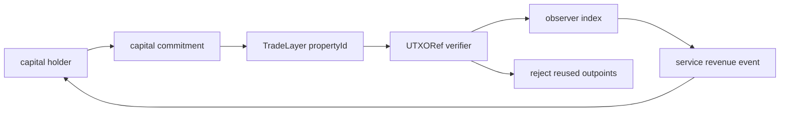
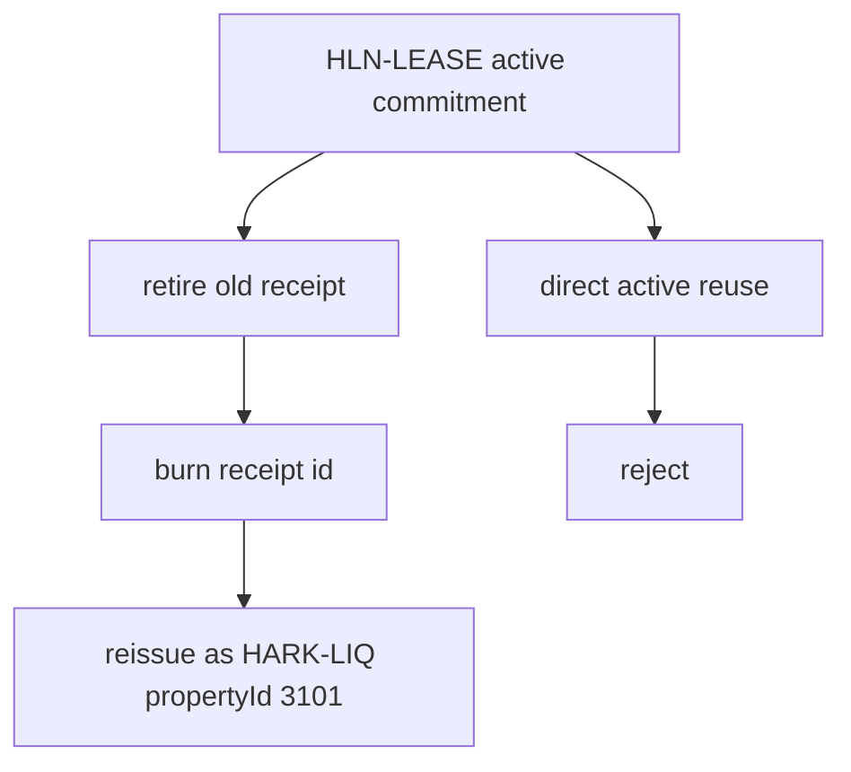

# Halal Capital Marketplace Snapshot

- Snapshot id: `268c376b614075e1ae041cc8c3a95a0897cc627fbdd3ea69f4b7ab120b4ad9e9`
- Registry id: `4b8d7d8c4d6342d4778f351fb7f0bfa8dadae903c727f0acc8c9f7fe4406c323`
- Total active capital sats: `12250000`
- Total service revenue sats: `28000`
- Exclusivity: `ok`

## Marketplace Flow

## Active Commitments

| propertyId | role | amount sats | public handle prefix | carrier prefix |
| --- | --- | --- | --- | --- |
| 1101 | lightning_channel_lease | 1000000 | 243ef3105038 | 8a061d33caf3 |
| 1102 | lightning_routing_reserve | 1250000 | 26020889e5f1 | ab4047389bd8 |
| 2101 | taproot_assets_edge_rfq_reserve | 1500000 | 965758e48329 | f3014b0bbf83 |
| 3101 | ark_round_liquidity_graft | 1750000 | 3dbb7a597598 | 1949d6450df4 |
| 4101 | tradelayer_dlc_margin_reserve | 2000000 | 815647309c26 | fb438852b805 |
| 5101 | watchtower_bond | 2250000 | 67839a4df6b9 | 384a55ab395a |
| 6101 | proof_publication_bond | 2500000 | 8b5077343648 | 4bd90df82bbb |

## Revenue Events

| propertyId | role | revenue sats | source |
| --- | --- | --- | --- |
| 1101 | lightning_channel_lease | 1000 | fixed-duration inbound liquidity lease and routing-quality fee |
| 1102 | lightning_routing_reserve | 2000 | routing fees and route availability premiums |
| 2101 | taproot_assets_edge_rfq_reserve | 3000 | Edge-node RFQ spread and proof-anchor service fee |
| 3101 | ark_round_liquidity_graft | 4000 | short-duration round liquidity and VTXO exit insurance premium |
| 4101 | tradelayer_dlc_margin_reserve | 5000 | DLC margin reservation, bounded PnL settlement, and liquidation service fee |
| 5101 | watchtower_bond | 6000 | challenge bounty, alert monitoring fee, and fraud-proof service fee |
| 6101 | proof_publication_bond | 7000 | proof publication, verifier receipt, and challenge-routing fee |

## Burn Before Reissue Demo

- Transition id: `927c8df2d1cd7da43b29a1c8ca6ef9d9bd6ee3e154fbc84a0164c7eed01176d5`
- Verification: `ok`