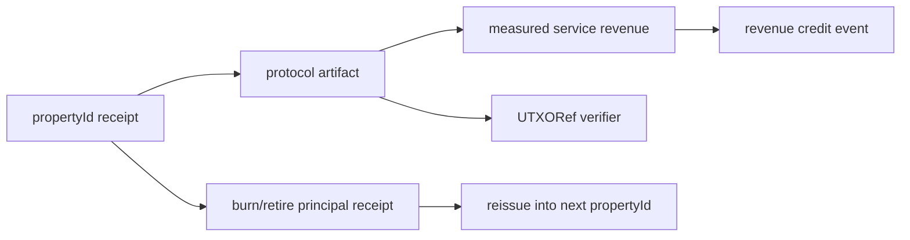

# Halal Capital Protocol Bundles

- Portfolio id: `b5b2ae3fae01ac5bd17bf1a666c82d4dc250efa6ceac4f97c15e1c3d8ed596c2`
- Token plan id: `01bf16a94fe229e28b941b73d5b23b49721544dc95fab7c524147f1d4ffcc029`
- Covered principal units: `4750000`
- Covered service revenue units: `10000`

## Protocol Flow

## Bundles

| propertyId | symbol | protocol artifact | service revenue | reissue target | verification |
| --- | --- | --- | --- | --- | --- |
| 1101 | HLN-LEASE | hln_lease_protocol_artifact | 1000 | 3101 | ok |
| 3101 | HARK-LIQ | hark_liq_protocol_artifact | 4000 | 4101 | ok |
| 4101 | HTL-DLCM | htl_dlcm_protocol_artifact | 5000 | 5101 | ok |

## Property Notes

### HLN-LEASE

- Bundle id: `fe5aa908243a8aa85ea8c0039ff9ac8cf1a8c5de396dc34c32bee71a247ba674`
- Commitment id: `b698b31e28e8339287b3c2db8f7ebb1706f405ab2779057fe76c25dc3fae035c`
- Protocol artifact id: `38f6b95fa1c1992d8ea110338213c4f9ed1234b8a0667febee899fbeeda4b523`
- Public handle: `243ef3105038a4e723b5c92e9a0a6a41365bcb07a3167120f05dc29d9ad11921`
- Carrier commitment: `8a061d33caf391d806063c957f21661ae508fb04b33c160fd034d56d576aa7f6`
- Retirement flow: `88b4539923b1ef08db01e3e94506e2a9afb2b5474343377520d5a587cc80dfdb`

### HARK-LIQ

- Bundle id: `16cc1c3707fbdb690a7bf7955f93fa8cda42badec95f578301e977997b000b89`
- Commitment id: `7a3b1ff6943f412416805372fec753829b5d24dbe97af5c2ac129ba1393751dd`
- Protocol artifact id: `6db1b568ef23c9a9bcec5d9190f491fccc446643b0eb94e13d99fc8dd90be505`
- Public handle: `3dbb7a597598086954ea009a841ab4d897bdc7b58ade301cef525e799883ccc5`
- Carrier commitment: `1949d6450df43fe6e298c4bbbd0393bb79f0160aaf8c5789786ee772120486fc`
- Retirement flow: `dfe2ad7e987df2dbfe4f393b2aa62ae15247f6524520742014fc7652000ab337`

### HTL-DLCM

- Bundle id: `57e1b02e721471d5492aecb0404033536922f70be34519f817d3506c28d04876`
- Commitment id: `ea8744e86190bb15647ada2954fc8d615204988bb9465f93b703b71e74025d16`
- Protocol artifact id: `c8d171761c0ac5de904cba02f30b405d7cf7b05d2f315ea4e46cee9a386b320f`
- Public handle: `815647309c26d17f49d02f6ac636a105684160e0bffa347d4870cbd41bc3ad03`
- Carrier commitment: `fb438852b805b7c556191812a0f4bad74ef92a1ba18a95909c22ff2a87a396a9`
- Retirement flow: `c9dfacb98ccbaa758082f245b4b662876330eb98bd13546867189bab7f2e2e12`