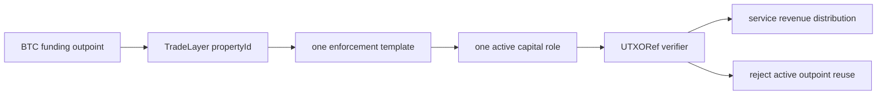
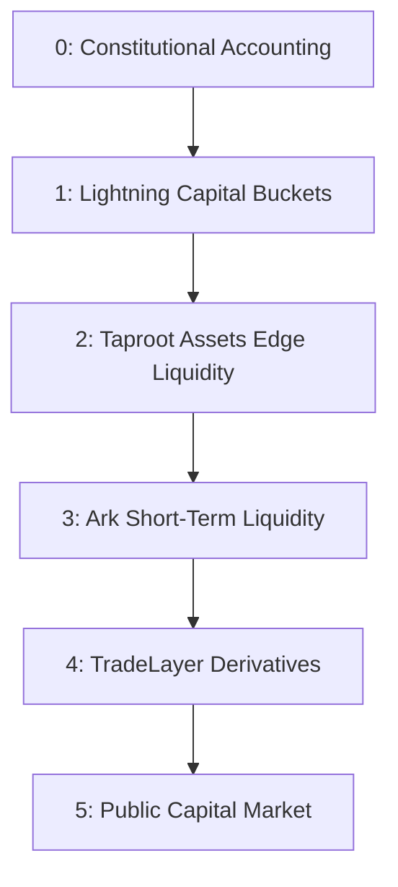
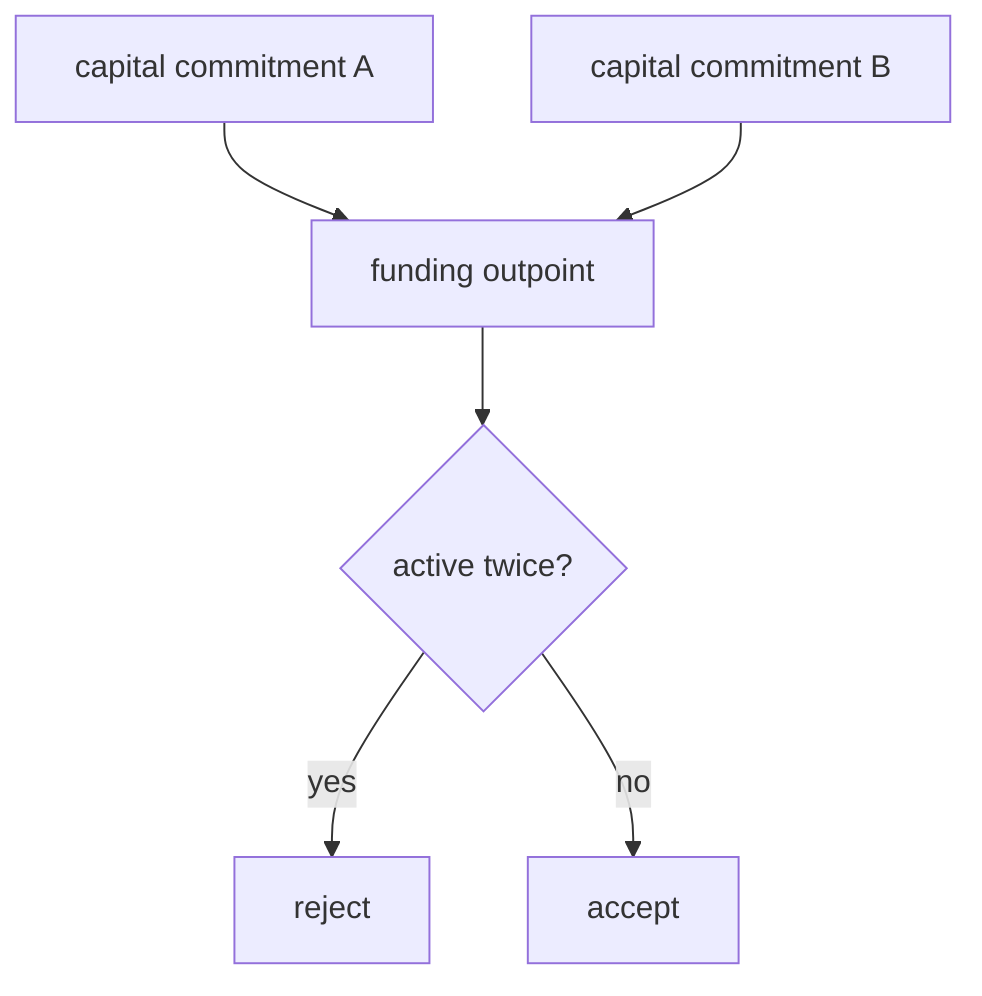

# Halal-Oriented Capital Staking Roadmap

- Roadmap id: `dc637a7de53236c594fa3217e9a9f22d71679d95e366b05483e7c35fd3c4500b`
- Registry id: `4b8d7d8c4d6342d4778f351fb7f0bfa8dadae903c727f0acc8c9f7fe4406c323`
- Principle: capital earns from real service revenue, one sat has one role, and no active outpoint can be reused
- Note: This is a product-control scaffold, not a religious certification; final templates require qualified review.

## Property Template Constitution

| propertyId | symbol | role | service revenue | Jurassic target |
| --- | --- | --- | --- | --- |
| 1101 | HLN-LEASE | lightning_channel_lease | fixed-duration inbound liquidity lease and routing-quality fee | lightning |
| 1102 | HLN-ROUTE | lightning_routing_reserve | routing fees and route availability premiums | lightning |
| 2101 | HTAP-RFQ | taproot_assets_edge_rfq_reserve | Edge-node RFQ spread and proof-anchor service fee | taproot_assets |
| 3101 | HARK-LIQ | ark_round_liquidity_graft | short-duration round liquidity and VTXO exit insurance premium | ark |
| 4101 | HTL-DLCM | tradelayer_dlc_margin_reserve | DLC margin reservation, bounded PnL settlement, and liquidation service fee | shinigami |
| 5101 | HWT-BOND | watchtower_bond | challenge bounty, alert monitoring fee, and fraud-proof service fee | lightning |
| 6101 | HPROOF | proof_publication_bond | proof publication, verifier receipt, and challenge-routing fee | shinigami |

## Roadmap

### Phase 0: Constitutional Accounting
- Objective: lock one propertyId to one capital mechanic and forbid active outpoint reuse
- Deliverable: template registry, exclusivity verifier, role-transition verifier

### Phase 1: Lightning Capital Buckets
- Objective: ship non-rehypothecated Lightning lease and routing-reserve property ids
- Deliverable: UTXORef evidence over lease proofs, watchtower handles, and sweep/splice carriers

### Phase 2: Taproot Assets Edge Liquidity
- Objective: add Edge-node RFQ reserves with proof-anchor handles and distribution cover
- Deliverable: RFQ quote evidence, proof-anchor namespace, and challengeable spread accounting

### Phase 3: Ark Short-Term Liquidity
- Objective: use Ark round liquidity as short-duration grafts for Lightning and TradeLayer flows
- Deliverable: round/VTXO claim handles, exit evidence, and cost/risk model

### Phase 4: TradeLayer Derivatives
- Objective: make margin reserves property-specific and bounded by DLC/UTXORef challenge logic
- Deliverable: PnL settlement templates, liquidation bands, oracle proofs, and margin non-reuse checks

### Phase 5: Public Capital Market
- Objective: let holders select audited property templates and receive service revenue from real network work
- Deliverable: capital marketplace, operator scorecards, watchtower bounties, and proof dashboards

## Jurassic Bitcoin Applications

| Motif | Product use | Capital control |
| --- | --- | --- |
| transcript multiplicity | alternative proof packages for leases, RFQs, Ark exits, and derivatives settlement | accept retry-equivalent proofs while rejecting constant-one digest collapse |
| identifier bifurcation | rotating route, proof-anchor, VTXO, margin, and watchtower handles | public handles can rotate without changing the committed capital role |
| carrier camouflage | publish proof hints through sweeps, splices, proof batches, Ark rounds, and settlement batches | proof publication looks like ordinary service activity instead of an exotic marker |

## Non-Rehypothecation Verifier

The verifier rejects active reuse even when the two commitments use different property ids.