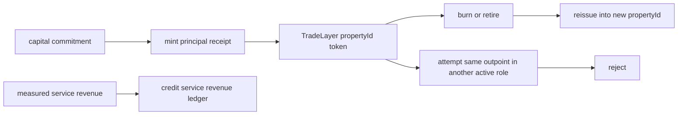

# Halal Capital TradeLayer Token Plan

- Plan id: `01bf16a94fe229e28b941b73d5b23b49721544dc95fab7c524147f1d4ffcc029`
- Marketplace snapshot: `268c376b614075e1ae041cc8c3a95a0897cc627fbdd3ea69f4b7ab120b4ad9e9`
- Principal receipt supply: `12250000`
- Service revenue accrual: `28000`
- Token specs: `7`

## Procedural Flow

## Property Balances

| propertyId | symbol | role | principal units | service revenue units | commitments |
| --- | --- | --- | --- | --- | --- |
| 1101 | HLN-LEASE | lightning_channel_lease | 1000000 | 1000 | 1 |
| 1102 | HLN-ROUTE | lightning_routing_reserve | 1250000 | 2000 | 1 |
| 2101 | HTAP-RFQ | taproot_assets_edge_rfq_reserve | 1500000 | 3000 | 1 |
| 3101 | HARK-LIQ | ark_round_liquidity_graft | 1750000 | 4000 | 1 |
| 4101 | HTL-DLCM | tradelayer_dlc_margin_reserve | 2000000 | 5000 | 1 |
| 5101 | HWT-BOND | watchtower_bond | 2250000 | 6000 | 1 |
| 6101 | HPROOF | proof_publication_bond | 2500000 | 7000 | 1 |

## Accounting Boundary

Principal receipt supply is a claim on committed backing sats. Service revenue is a separate accrual ledger entry. The verifier can therefore reject hidden leverage by checking that active principal receipts sum to active committed capital, while revenue credits sum only to measured service events.

## Burn Before Reissue

- Instruction id: `17ceed1da4e4439d05e70ec10fd58b71becff6c42ee05d592bd98820efe26ec3`
- Burn event: `4c7cbf28c40fbd63cac3efb57325dba896de82a479cea0fe312ef7cf663a0437`
- Reissue event: `0e1e4fe71b39b013528aba4ac0a4fac2734b59604184aa1f471a85bb64249d0d`
- Old status required: `retired`