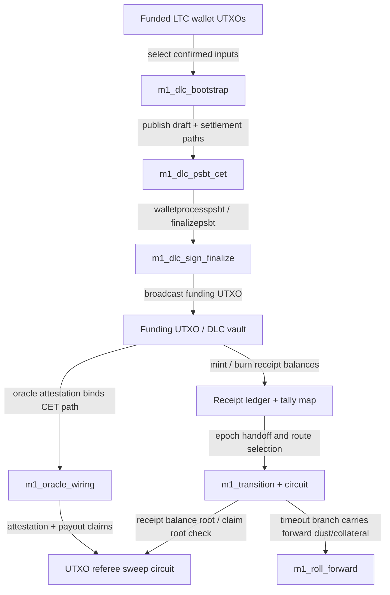

# M1 BitVM / DLC Visualization

- Generated: `2026-04-08T16:09:04.026Z`
- Report hash: `b1f45f232f9f4af71ffcaa0e1edd205a4a2baf5f7014726b422aeb49dc558545`

## Template
- Template ID: `dlc-receipt-ltc-testnet-v1`
- Template hash: `60e19d0c4f34a09a690e679230bf41a63252306e0e06a09e1b090efbcbb7b499`
- Settlement model: `bounded-loss-carry-forward`
- Active paths: `settle-gain, settle-loss`
- Timeout path: `roll`

## Circuits
### referee
- Purpose: sweep-referee
- Name: `utxo_referee_verify`
- Total gates: `8296855`
- Free gates: `5165068`
- Non-free gates: `3131787`
- Wire count: `8307387`
- Inputs: `10532` bits
- Outputs: `1` bits
- Gate breakdown: `{"AND":3131787,"XOR":5032457,"INV":132611,"OR":0}`
- Note: Verifies sweep membership, cap, residual destination, and epoch binding.
- Note: Current hash path uses a SHA256 pair-hash circuit for committed Merkle checks.
- Note: Visualization reports the bounded demo profile (4 payouts, depth 8) to keep circuit stats tractable.

### transition
- Purpose: bounded-loss-router
- Name: `m1_binary_settlement_transition`
- Total gates: `4561294`
- Free gates: `2808894`
- Non-free gates: `1752400`
- Wire count: `4567715`
- Inputs: `6421` bits
- Outputs: `1` bits
- Gate breakdown: `{"AND":1752400,"XOR":2740368,"INV":68526,"OR":0}`
- Note: Selects flat, pnl, settle-loss, settle-gain, or roll route.
- Note: Proves exact satoshi conservation and claim-root binding.

## Flow

## Path Summary
- Path model: `bounded-loss-carry-forward`
- Active paths: `settle-gain, settle-loss`
- Timeout path: `roll`
- `wallet` -> `bootstrap`: select confirmed inputs
- `bootstrap` -> `psbt`: publish draft + settlement paths
- `psbt` -> `sign`: walletprocesspsbt / finalizepsbt
- `sign` -> `funding`: broadcast funding UTXO
- `funding` -> `oracle`: oracle attestation binds CET path
- `funding` -> `ledger`: mint / burn receipt balances
- `ledger` -> `transition`: epoch handoff and route selection
- `transition` -> `roll`: timeout branch carries forward dust/collateral
- `oracle` -> `referee`: attestation + payout claims
- `transition` -> `referee`: receipt balance root / claim root check

## Latest Artifacts
- draft: `m1_dlc_draft_latest.json` (m1_dlc_draft, d3d9900d5fb4a0d357eb45ed8cef90d80724d4e153ba87471e4ecb5b7250de08)
- fundingPsbt: `m1_funding_psbt_latest.json` (m1_funding_psbt, bd55b81628d68ca2cadf9f337a03d3e86fad3efccfadc731acfc0904b7f06608)
- finalized: `m1_funding_finalized_latest.json` (m1_funding_finalized, 021e09d3b9fe62386de4ae296c1841baf55eb941ff0685201168957374a3c705)
- cetSkeletons: `m1_cet_skeletons_latest.json` (m1_cet_skeletons, f273bb6f3a1ab5253d6406bd6d1f1578efe5f6d6236fb73c77b04e23b304ac3f)
- oracleWiring: `m1_oracle_wiring_latest.json` (m1_oracle_wiring, 44bf7351da7764f91ca0d8feffcdc9831f0c9d68e6164e651d9eaf8d76498b13)
- challengeBundle: `m1_challenge_bundle_latest.json` (m1_challenge_bundle, 8018b5d93c3b73e2474054913045f0f39260d5d1b6f49fb6da678431ef475707)
- challengeWitness: `m1_challenge_witness_latest.json` (m1_challenge_witness, caa6716b426a4912001972c4f2f80aef046e32d35522f28eb79774223191fb7c)
- rollForward: `m1_roll_forward_latest.json` (m1_roll_forward, d963a68b759c6b922688cb1e25c286a6923d7dc55706d04949f347c094bbdd0c)
- proceduralSync: `bitvm_procedural_sync_latest.json` (bitvm_procedural_sync, 1b829d3c80b4c880e5aedd9297bfd9fae64deb6f2fffef4c4e540715a37b3ac7)
- parallelUtxoIndex: `m1_parallel_utxo_index_latest.json` (m1_parallel_utxo_index, 3954c7d505db1721a441088fbb4eac063b58dc47a0a6cbd5daa70300efd85abc)
- pipeline: `m1_pipeline_latest.json` (m1_pipeline, cfe94c3915d2082b64dd8588b7b8b633947d39c6875089bd2bf491159b86705b)

## Live Ops
- Procedural state: `SETTLED`
- Procedural contract: `ltc-testnet-epoch-1-1775582088654`
- Procedural funding txid: `76a619590a5365bbffcb4a47328d7bb68544848828151d6378faf0a2501511f5`
- Procedural settlement route: `roll`
- Pipeline status: `ok`
- Pipeline mode: `replay`
- Pipeline selected path: `null`
- Pipeline procedural state: `SETTLED`
- Pipeline parallel UTXO txs: `5`
- Parallel UTXO chain: `litecoin-testnet`
- Parallel UTXO funding txid: `76a619590a5365bbffcb4a47328d7bb68544848828151d6378faf0a2501511f5`
- Parallel UTXO timeout spend: `68b228d210374d9064d5c1173cdfebc0d7d5b408a09cf2395ddcd25b2f751062`
- Parallel UTXO transactions: `5`
- Parallel UTXO semantic refs: `2`