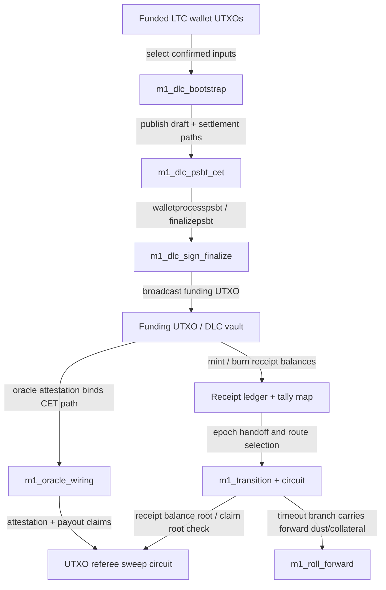

# M1 BitVM / DLC Visualization

- Generated: `2026-04-04T01:01:22.750Z`
- Report hash: `8249840fb2b301cfd4d4522996cb6fe85f5b44572ad74def38363492a5f47722`

## Template
- Template ID: `dlc-receipt-ltc-testnet-v1`
- Template hash: `79755ea8e3b1df4e4c4266d8809e46e6a50356dec24de20d298a6e64f28482d7`
- Settlement model: `bounded-loss-carry-forward`
- Active paths: `settle-gain, settle-loss`
- Timeout path: `roll`

## Circuits
### referee
- Purpose: sweep-referee
- Name: `utxo_referee_verify`
- Total gates: `338855`
- Free gates: `236308`
- Non-free gates: `102547`
- Wire count: `375343`
- Inputs: `36488` bits
- Outputs: `1` bits
- Gate breakdown: `{"AND":102547,"XOR":233745,"INV":2563,"OR":0}`
- Note: Verifies sweep membership, cap, residual destination, and epoch binding.
- Note: Current hash is a placeholder circuit primitive, not full SHA256.

### transition
- Purpose: bounded-loss-router
- Name: `m1_binary_settlement_transition`
- Total gates: `457102`
- Free gates: `257086`
- Non-free gates: `200016`
- Wire count: `463523`
- Inputs: `6421` bits
- Outputs: `1` bits
- Gate breakdown: `{"AND":200016,"XOR":254096,"INV":2990,"OR":0}`
- Note: Selects flat, pnl, settle-loss, settle-gain, or roll route.
- Note: Proves exact satoshi conservation and claim-root binding.

## Flow

## Path Summary
- Path model: `bounded-loss-carry-forward`
- Active paths: `settle-gain, settle-loss`
- Timeout path: `roll`
- `wallet` -> `bootstrap`: select confirmed inputs
- `bootstrap` -> `psbt`: publish draft + settlement paths
- `psbt` -> `sign`: walletprocesspsbt / finalizepsbt
- `sign` -> `funding`: broadcast funding UTXO
- `funding` -> `oracle`: oracle attestation binds CET path
- `funding` -> `ledger`: mint / burn receipt balances
- `ledger` -> `transition`: epoch handoff and route selection
- `transition` -> `roll`: timeout branch carries forward dust/collateral
- `oracle` -> `referee`: attestation + payout claims
- `transition` -> `referee`: receipt balance root / claim root check

## Latest Artifacts
- draft: `m1_dlc_draft_latest.json` (m1_dlc_draft, 255c2ac4f41515f2876e0d1cb163b553725e8dabbe5007df1703315332b0c339)
- fundingPsbt: `m1_funding_psbt_latest.json` (m1_funding_psbt, 061a4bedcad0da3c43ab57731ac02153425ec7bb1074fe4d8c9c50f86c4e7475)
- finalized: `m1_funding_finalized_latest.json` (m1_funding_finalized, 54ff8a32668cb02b203f4d1d856348b0b63abb2b74388d98173461494377e18d)
- cetSkeletons: `m1_cet_skeletons_latest.json` (m1_cet_skeletons, 4bfe8f7b50a4d191e4257c201b351498886dda91dcd2f142e0faf3ac5c890564)
- oracleWiring: `m1_oracle_wiring_latest.json` (m1_oracle_wiring, de6a85baa9171c10322f740d85260596bb40c30d2aaeb29ec568b07978e73c6a)
- challengeBundle: `m1_challenge_bundle_latest.json` (m1_challenge_bundle, abf09c8a6575dff87092f3b1743ffab92d192b3973227cdfe802d51947b5b1e2)
- challengeWitness: `m1_challenge_witness_latest.json` (m1_challenge_witness, 1aa29fbdf55f6412552a132de04f2005a69e7ce6e1172442efb70c352563ae6b)
- rollForward: `m1_roll_forward_latest.json` (m1_roll_forward, 99db96f1d08dce99d71bf6e38684dd1fe33ce7cde455a23d0100147b76f507fe)