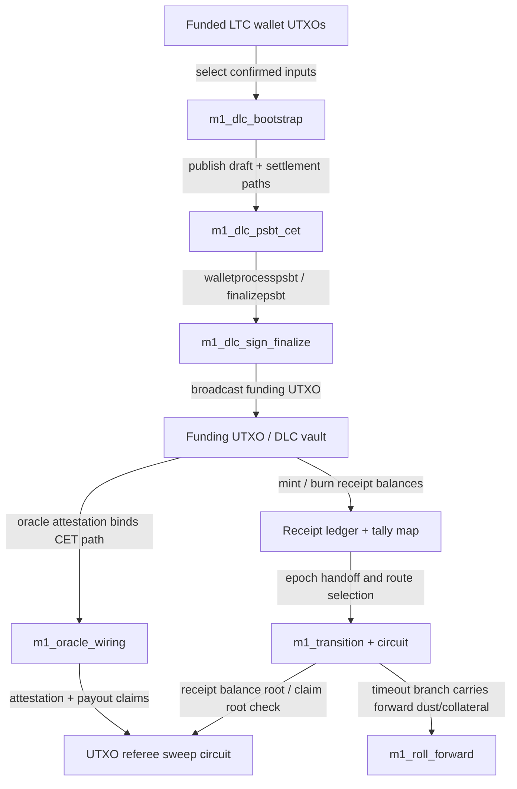

# M1 BitVM / DLC Visualization

- Generated: `2026-04-05T19:06:46.080Z`
- Report hash: `3c4478309d6a60d8da9ddd010b4b560b3aea3563c08bf81bdee4cc317c2fff1b`

## Template
- Template ID: `dlc-receipt-ltc-testnet-v1`
- Template hash: `5a57ecb55beff99ff5b523d5cdd021aef3781df8b318f9ac9e176cc7c6400151`
- Settlement model: `bounded-loss-carry-forward`
- Active paths: `settle-gain, settle-loss`
- Timeout path: `roll`

## Circuits
### referee
- Purpose: sweep-referee
- Name: `utxo_referee_verify`
- Total gates: `8296855`
- Free gates: `5165068`
- Non-free gates: `3131787`
- Wire count: `8307387`
- Inputs: `10532` bits
- Outputs: `1` bits
- Gate breakdown: `{"AND":3131787,"XOR":5032457,"INV":132611,"OR":0}`
- Note: Verifies sweep membership, cap, residual destination, and epoch binding.
- Note: Current hash path uses a SHA256 pair-hash circuit for committed Merkle checks.
- Note: Visualization reports the bounded demo profile (4 payouts, depth 8) to keep circuit stats tractable.

### transition
- Purpose: bounded-loss-router
- Name: `m1_binary_settlement_transition`
- Total gates: `4561294`
- Free gates: `2808894`
- Non-free gates: `1752400`
- Wire count: `4567715`
- Inputs: `6421` bits
- Outputs: `1` bits
- Gate breakdown: `{"AND":1752400,"XOR":2740368,"INV":68526,"OR":0}`
- Note: Selects flat, pnl, settle-loss, settle-gain, or roll route.
- Note: Proves exact satoshi conservation and claim-root binding.

## Flow

## Path Summary
- Path model: `bounded-loss-carry-forward`
- Active paths: `settle-gain, settle-loss`
- Timeout path: `roll`
- `wallet` -> `bootstrap`: select confirmed inputs
- `bootstrap` -> `psbt`: publish draft + settlement paths
- `psbt` -> `sign`: walletprocesspsbt / finalizepsbt
- `sign` -> `funding`: broadcast funding UTXO
- `funding` -> `oracle`: oracle attestation binds CET path
- `funding` -> `ledger`: mint / burn receipt balances
- `ledger` -> `transition`: epoch handoff and route selection
- `transition` -> `roll`: timeout branch carries forward dust/collateral
- `oracle` -> `referee`: attestation + payout claims
- `transition` -> `referee`: receipt balance root / claim root check

## Latest Artifacts
- draft: `m1_dlc_draft_latest.json` (m1_dlc_draft, 2759ae4d6643e9c84f16df6bb5c16579aeb6a84178e72c4b2b4d983cec0720a4)
- fundingPsbt: `m1_funding_psbt_latest.json` (m1_funding_psbt, 057e0ffee7cbef88e2279a2eb83bc8127821432cf2d72e906e6fb1c93169ea2e)
- finalized: `m1_funding_finalized_latest.json` (m1_funding_finalized, 54ff8a32668cb02b203f4d1d856348b0b63abb2b74388d98173461494377e18d)
- cetSkeletons: `m1_cet_skeletons_latest.json` (m1_cet_skeletons, d8582118bbeddb862ce0b6895d4ef2e209f0e2aa2760102d5daf2a532d7b123a)
- oracleWiring: `m1_oracle_wiring_latest.json` (m1_oracle_wiring, 5320d2352af02d8ae13c1ba8e4731a4063e0491f9f4c923a9deeedf72db951be)
- challengeBundle: `m1_challenge_bundle_latest.json` (m1_challenge_bundle, 0473dfd368fab9deddc5b19f59d8ef8aa9617708f218aeb17712feddaadbd161)
- challengeWitness: `m1_challenge_witness_latest.json` (m1_challenge_witness, f61e4e676ce72171a1fa69bb2fa707104c3e114c71daa06a233f981b6b9a8465)
- rollForward: `m1_roll_forward_latest.json` (m1_roll_forward, 99db96f1d08dce99d71bf6e38684dd1fe33ce7cde455a23d0100147b76f507fe)