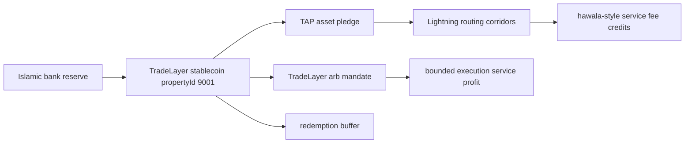

# Sukuk Stablecoin Halal DeFi Rails

- Portfolio id: `59be1fd1467127a1faccbe18639fd591c1914b204de477275983e478911b7f3f`
- Stablecoin propertyId: `9001`
- Issued units: `5000000000`
- DeFi allocated units: `3000000000`
- Redemption buffer units: `2000000000`
- Total service fee units: `4552500`

## Flow

## Reserve

- Reserve id: `3f9f83b76df684ccc35d31932ad7c0b411faf245b13232f4234ececdc31f5ea2`
- Eligible reserve units: `5885000000`
- Coverage bps: `11770`
- Farm REIT backing enabled: `false`

## Lightning Hawala-Style Routes

| corridor | routed units | computed fee bps | service fee units |
| --- | --- | --- | --- |
| oman-muscat-to-uae-dubai | 650000000 | 22 | 1432500 |
| oman-muscat-to-saudi-riyadh | 450000000 | 19 | 857500 |
| oman-muscat-to-india-kochi | 300000000 | 26 | 782500 |

## TradeLayer Arb Mandate

| pair | venues | amount units | net spread bps | expected service profit |
| --- | --- | --- | --- | --- |
| SUKUSD/TLUSD | tradelayer-orderbook-a -> tradelayer-orderbook-b | 250000000 | 25 | 625000 |
| SUKUSD/BTC | tradelayer-rfq-edge -> taproot-assets-rfq-edge | 200000000 | 27 | 540000 |
| SUKUSD/OMRUSD | tradelayer-vwap-window -> lightning-edge-liquidity | 150000000 | 21 | 315000 |

## Halal Controls

- Stablecoin holders do not receive portfolio yield by holding the par token.
- Lightning and arb revenues are service fees or execution profits from explicit pledged mandates.
- Leverage, borrowing/lending, short selling, guaranteed returns, and impermissible asset touch are disabled in the deterministic mandate.
- Farm REIT diversification is modeled as future work and receives no reserve backing credit in this artifact.