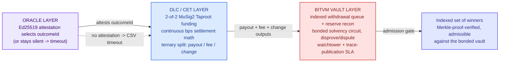
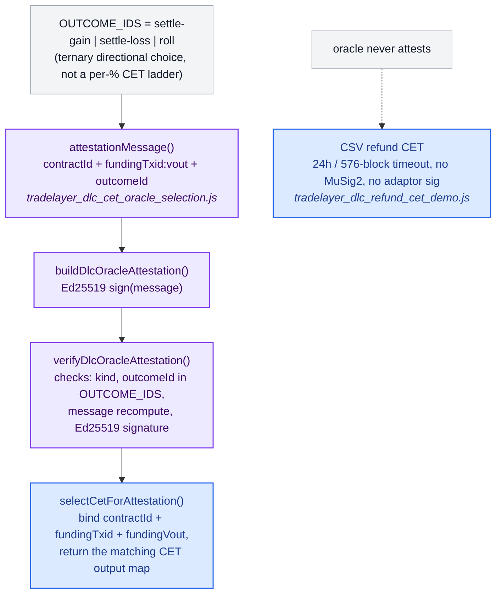
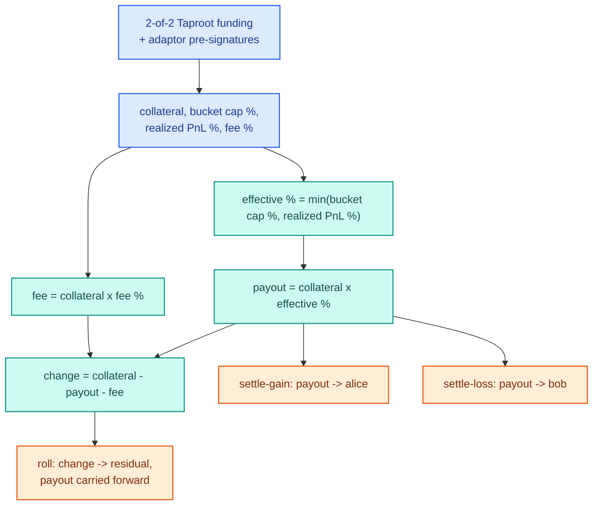
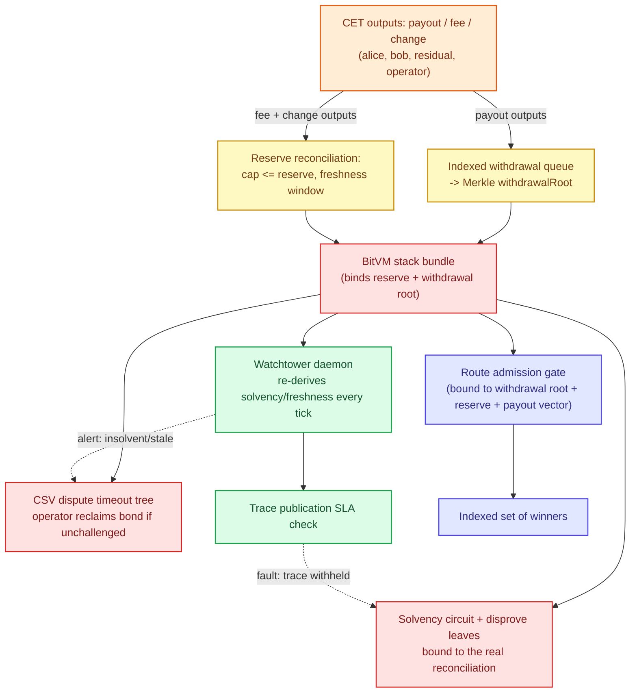

# DLC → CET → BitVM Vault Routing (current repo state)

Grounded in the actual modules in `bitvm3/utxo_referee/`, not an idealized
design. Evidence tiers per `CLAIMS_MATRIX.md` apply per-node (oracle
attestation + CET selection + fee/queue math = LOCAL_SIMULATION/unit-tested;
funding/CSV-refund/BitVM disprove legs = NETWORK_VERIFIED self-play on
LTCTEST; independent-challenger operation = NOT_IMPLEMENTED, see
`SECURITY_BLOCKERS.md` #3/#5).

Split into four diagrams (the single combined graph got too dense to read;
kept as `docs/diagrams/dlc_cet_full_reference.svg`/`.png` for anyone who
wants it all on one page).

Each diagram below is available as both `.svg` (vector, best for print/zoom)
and `.png` (raster, 3x scale — use this for Google Docs: Insert > Image >
Upload from computer, since Docs doesn't reliably import SVG).

## On the "n% loss increment" question

The percentage granularity **does** exist, but it's continuous math done
once per contract, not a ladder of discrete per-percentage CETs:
`computeBoundedSettlementAmounts()` (`m1_transition.js`) computes
`effectivePnlBps = min(bucketCapBps, realizedPnlBps)` — an oracle-reported
PnL in basis points, capped at a bucket — and scales the payout by that
single value. `buildDlcSettlementOutcomes()`
(`tradelayer_dlc_cet_oracle_selection.js`) then wraps that **one** computed
payout magnitude into three CET branches, and the oracle attestation only
picks a *direction* (`settle-gain` → alice, `settle-loss` → bob, `roll` →
carry forward) rather than selecting among many pre-built percentage-bucket
CETs. The residual/change output (`refundSats` / `rolloverCollateralSats`)
is exactly the mechanism you're recalling: it's what "banks" whatever the
bps math didn't pay out, back into the vault, instead of needing a discrete
CET per possible outcome value. Diagram 2 below shows this precisely.

---

## 1. High-level overview

## 2. Oracle layer

## 3. DLC settlement math (where the % increment actually lives)

*(Node text is simplified for readability; the exact fields are
`bucketCapBps`/`realizedPnlBps`/`feeBps` as basis points, computed by
`computeBoundedSettlementAmounts()` in `m1_transition.js` and wrapped into
CETs by `buildDlcSettlementOutcomes()` in
`tradelayer_dlc_cet_oracle_selection.js`. The "% increment" is this
continuous `effectivePnlBps` value, computed once per contract — not a
discrete CET per percentage bucket; the `change` output is what absorbs
whatever the single payout calculation didn't pay out.)*

## 4. BitVM vault routing (fees, change, indexed winners)

*(Simplified for readability — the underlying modules are
`tradelayer_withdrawal_queue_referee.js`, `tradelayer_reserve_reconciliation_referee.js`,
`tradelayer_bitvm_stack.js`, `tradelayer_bitvm_comparator.js` +
`tradelayer_bitvm_circuit.js` + `tradelayer_bitvm_solvency_referee.js` (folded
into "solvency circuit + disprove leaves"), `tradelayer_bitvm_dispute.js`,
the quirk-indexed route referee, `tradelayer_watchtower_daemon.js`, and
`tradelayer_trace_publication.js`. Per-outcome payout/fee/change breakdown
lives in diagram 3.)*

## Self-play caveat

Every BitVM disprove/timeout/watchtower-fault edge in diagram 4 has only
been exercised with the operator also acting as challenger. See
`SECURITY_BLOCKERS.md` #3 and #5.
